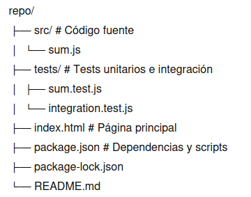

# Proyecto: Deploy automático con Render + Tests

## Descripción
Este proyecto demuestra un **pipeline profesional CI/CD** usando Render para desplegar una aplicación HTML/Node sencilla, integrando **tests automáticos**, **despliegue controlado** y **rollback manual**.  

La idea es que **cualquier push a la rama `main`** Render despliega la versión. En caso de fallo, el deploy se bloquea, y el rollback manual restaura la versión estable.

---

## Flujo conceptual del pipeline

### Lista paso a paso
1. Push a la rama `main` en GitHub.
2. Render detecta el push automáticamente.
3. Render ejecuta el **Build Command**:
   - `npm install` → instala dependencias
   - `npm test` → corre tests unitarios e integración
4. Si los tests pasan → deploy automático en Render.
5. Si los tests fallan → deploy bloqueado, versión estable intacta.
6. Rollback manual disponible desde Render si es necesario.

### Diagrama ASCII


---

## Estrategia CI/CD implementada
- **Separación clara de test y deploy:** Los tests se ejecutan primero; si fallan, el deploy no ocurre.  
- **Despliegue automático:** Build exitoso → Render publica automáticamente la versión.  
- **Rollback manual:** Permite restaurar una versión estable en caso de problemas en producción.  
- **Control de versiones:** Cada deploy corresponde al commit correcto en `main`.  
- **Entornos diferenciados:**
  - **Local:** Tests ejecutados manualmente (`npm test`)  
  - **Repositorio:** Historial de commits y cambios versionados  
  - **Render:** Build/Deploy/Runtime logs, rollback y versión publicada

---

## Estructura del proyecto


# Pipeline de Despliegue con Render y Tests Automáticos

Este pipeline está basado en **Render** + **Build Command** y ejecuta automáticamente los tests antes de desplegar.

## 1. Clonar el repositorio

```bash
git clone <URL_DEL_REPO>
cd <NOMBRE_DEL_REPO>
```

## 2. Instalar dependencias localmente

```bash
npm install
```

## 3. Ejecutar los test manualmente

```bash
npm test
```
Si los tests pasan → listo para deploy
Si algún test falla → corregir antes de push
